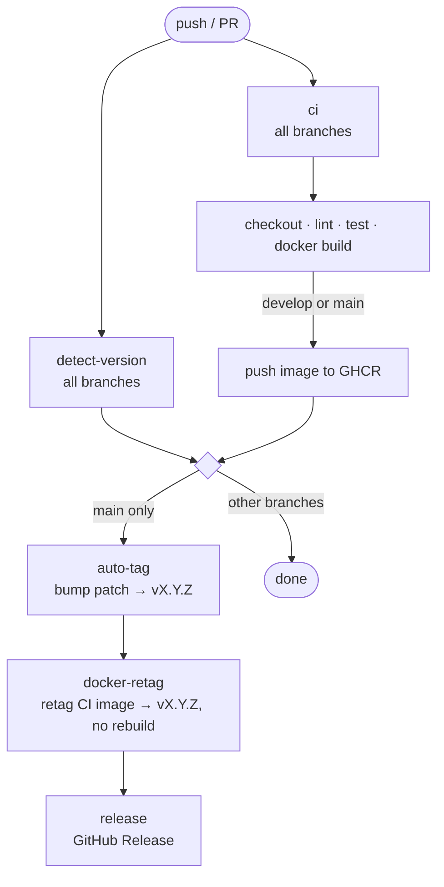

# Guide: Docker Service Pipeline

End-to-end CI/CD setup for a Docker-based service published to a container registry (GHCR).

## Pipeline Overview



## Key Design Principle: Build Once, Promote by Retag

The Docker image is built **once** in the CI job. On `main`, a retag job adds the clean
semver tag to the same manifest — no second build, no digest mismatch between CI and prod.

## File Structure

```
.github/
└── workflows/
    └── on-push.yml    ← single pipeline file (all jobs)
```

## on-push.yml

```yaml
name: CI — Branch push

on:
  push:
    branches:
      - main
      - develop
      - "feature/**"
      - "release/**"
      - "hotfix/**"
    paths-ignore:
      - "**/*.md"
      - "docs/**"
  pull_request:
    branches:
      - main
      - develop
  workflow_dispatch:

concurrency:
  group: ci-${{ github.ref }}
  cancel-in-progress: true

jobs:
  detect-version:
    uses: ITlusions/ITL.Github/.github/workflows/_reusable-detect-version.yml@main

  ci:
    needs: detect-version
    uses: ITlusions/ITL.Github/.github/workflows/_reusable-ci-docker.yml@main
    with:
      image-name: "ghcr.io/itlusions/myapp"
      checkout-path: "MyApp"
      dependency-repo: "ITlusions/MyApp.Core"    # remove if no dependency
      dependency-path: "MyApp.Core"
      version: ${{ needs.detect-version.outputs.image-tag }}
      push: ${{ github.event_name == 'push' && (github.ref == 'refs/heads/main' || github.ref == 'refs/heads/develop') }}
      registry-username: ${{ github.actor }}
    secrets:
      gh-pat: ${{ secrets.GH_PAT }}

  auto-tag:
    needs: ci
    if: github.event_name == 'push' && github.ref == 'refs/heads/main'
    uses: ITlusions/ITL.Github/.github/workflows/_reusable-auto-tag.yml@main
    with:
      commit-sha: ${{ github.sha }}
    secrets:
      gh-pat: ${{ secrets.GH_PAT }}

  docker:
    needs: [ci, auto-tag]
    if: github.event_name == 'push' && github.ref == 'refs/heads/main'
    uses: ITlusions/ITL.Github/.github/workflows/_reusable-docker-retag.yml@main
    with:
      source-image: ${{ needs.ci.outputs.image-tag }}
      target-image: "ghcr.io/itlusions/myapp"
      target-tag: ${{ needs.auto-tag.outputs.tag }}
    secrets:
      registry-password: ${{ secrets.GH_PAT }}

  release:
    needs: [auto-tag, docker]
    if: github.event_name == 'push' && github.ref == 'refs/heads/main'
    uses: ITlusions/ITL.Github/.github/workflows/_reusable-release-gh.yml@main
    with:
      tag: ${{ needs.auto-tag.outputs.tag }}
      generate-release-notes: true
```

## Branch Behavior

| Branch | CI | Push image | Auto-tag | Retag | Release |
|---|---|---|---|---|---|
| `feature/**` | lint + test + build | — | — | — | — |
| `develop` | lint + test + build | `dev` tag | — | — | — |
| `main` | lint + test + build | versioned tag | `vX.Y.Z` | `vX.Y.Z` | Stable |

## Image Tag Flow (main branch example)

```
CI builds:     ghcr.io/itlusions/myapp:0.1.4-feature-x.12-abc1234
                                    ↓  auto-tag → v0.1.4
Retag applies: ghcr.io/itlusions/myapp:v0.1.4
```

## Required Secrets

| Secret | Used by |
|---|---|
| `GH_PAT` | CI (cross-repo checkout + registry push), auto-tag, docker retag |

## GHCR Setup Checklist

- [ ] `GH_PAT` has `write:packages` scope
- [ ] The PAT owner has write access to the target repository
- [ ] The image name matches the repo: `ghcr.io/<org>/<image>`
- [ ] GitHub package visibility is set to internal or public as needed
