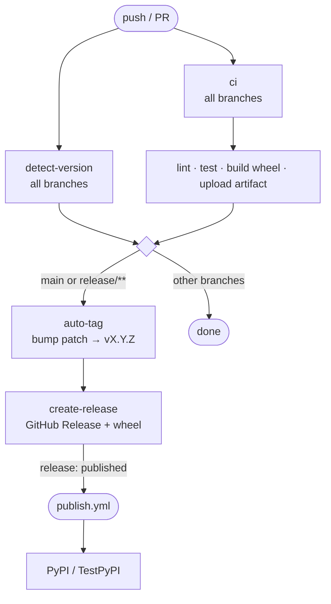

# Guide: Python Library Pipeline

End-to-end CI/CD setup for a Python package published to PyPI.

## Pipeline Overview



## File Structure

```
.github/
├── workflows/
│   ├── ci.yml         ← main pipeline (on push/PR)
│   └── publish.yml    ← triggered by release: published
```

## ci.yml

```yaml
name: CI — Build & Test

on:
  push:
    branches:
      - main
      - develop
      - "feature/**"
      - "release/**"
      - "hotfix/**"
    paths-ignore:
      - "**/*.md"
      - "docs/**"
  pull_request:
    branches:
      - main
      - develop
      - "release/**"
  workflow_dispatch:

concurrency:
  group: ci-${{ github.ref }}
  cancel-in-progress: true

jobs:
  detect-version:
    uses: ITlusions/ITL.Github/.github/workflows/_reusable-detect-version.yml@main

  ci:
    needs: detect-version
    uses: ITlusions/ITL.Github/.github/workflows/_reusable-ci-python.yml@main
    with:
      python-version: "3.12"
      artifact-name: "myproject-wheel"
      version: ${{ needs.detect-version.outputs.python-version }}
      ruff-src: "src/"
      test-path: "tests/"
      test-markers-exclude: "integration"
      postgres-user: "myapp"
      postgres-password: "myapp_test"
      postgres-db: "myapp_test"
      extra-install: "pip install -e ."

  auto-tag:
    needs: ci
    if: |
      github.event_name == 'push' &&
      (
        github.ref == 'refs/heads/main' ||
        startsWith(github.ref, 'refs/heads/release/')
      )
    uses: ITlusions/ITL.Github/.github/workflows/_reusable-auto-tag.yml@main
    with:
      commit-sha: ${{ github.sha }}
    secrets:
      gh-pat: ${{ secrets.GH_PAT }}

  create-release:
    needs: auto-tag
    if: |
      github.event_name == 'push' &&
      (
        github.ref == 'refs/heads/main' ||
        startsWith(github.ref, 'refs/heads/release/')
      )
    uses: ITlusions/ITL.Github/.github/workflows/_reusable-release-gh.yml@main
    with:
      tag: ${{ needs.auto-tag.outputs.tag }}
      artifact-name: "myproject-wheel"
      generate-release-notes: true
```

## publish.yml

```yaml
name: Publish — Release published

on:
  release:
    types: [published]

concurrency:
  group: publish-${{ github.event.release.tag_name }}
  cancel-in-progress: false

jobs:
  resolve-target:
    runs-on: ubuntu-latest
    outputs:
      environment: ${{ steps.check.outputs.environment }}
    steps:
      - name: Check release tag type
        id: check
        run: |
          TAG="${{ github.event.release.tag_name }}"
          if [[ "$TAG" == *"-"* ]]; then
            echo "environment=staging" >> $GITHUB_OUTPUT
          else
            echo "environment=production" >> $GITHUB_OUTPUT
          fi

  publish:
    needs: resolve-target
    uses: ITlusions/ITL.Github/.github/workflows/_reusable-publish-pypi.yml@main
    with:
      artifact-name: "myproject-wheel"
      commit-sha: ${{ github.event.release.target_commitish }}
      ci-workflow-name: "CI — Build & Test"
      environment: ${{ needs.resolve-target.outputs.environment }}
      fallback-build: false
```

## Branch Behavior

| Branch | CI | Auto-tag | Release | Publish |
|---|---|---|---|---|
| `feature/**` | lint + test + build | — | — | — |
| `hotfix/**` | lint + test + build | — | — | — |
| `develop` | lint + test + build | — | — | — |
| `release/**` | lint + test + build | `vX.Y.Z-rc.N` | Pre-release | TestPyPI |
| `main` | lint + test + build | `vX.Y.Z` | Stable | PyPI |

## Required Secrets

| Secret | Used by |
|---|---|
| `GH_PAT` | `auto-tag` (pushing tags) |

## PyPI Setup Checklist

- [ ] Configure Trusted Publisher on PyPI: owner=`ITlusions`, repo=your repo, workflow=`publish.yml`, env=`production`
- [ ] Configure Trusted Publisher on TestPyPI: same, env=`staging`
- [ ] Create GitHub Environments `production` and `staging` in repo settings
- [ ] (Optional) Add approval gate to `production` environment

## Real-world example

See [ITL.BrainCell](braincell) for the production implementation of this pipeline, including annotated `ci.yml` and `publish.yml`, integration test exclusion, OIDC Trusted Publisher setup, and the no-rebuild contract explained in detail.
